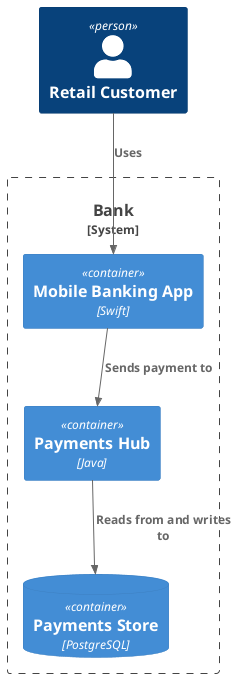

# Container view

The container view, drawn in PlantUML (C4).

```plantuml
@startuml
!include <C4/C4_Container>
Person(cust, "Retail Customer")
System_Boundary(bank, "Bank") {
  Container(mob, "Mobile Banking App", "Swift")
  Container(hub, "Payments Hub", "Java")
  ContainerDb(store, "Payments Store", "PostgreSQL")
}
Rel(cust, mob, "Uses")
Rel(mob, hub, "Sends payment to")
Rel(hub, store, "Reads from and writes to")
@enduml
```
