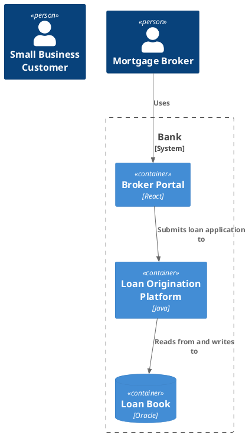

# Container view

```plantuml
@startuml
!include <C4/C4_Container>
Person(cust, "Small Business Customer")
Person(broker, "Mortgage Broker")
System_Boundary(bank, "Bank") {
  Container(portal, "Broker Portal", "React")
  Container(lop, "Loan Origination Platform", "Java")
  ContainerDb(book, "Loan Book", "Oracle")
}
Rel(broker, portal, "Uses")
Rel(portal, lop, "Submits loan application to")
Rel(lop, book, "Reads from and writes to")
@enduml
```
